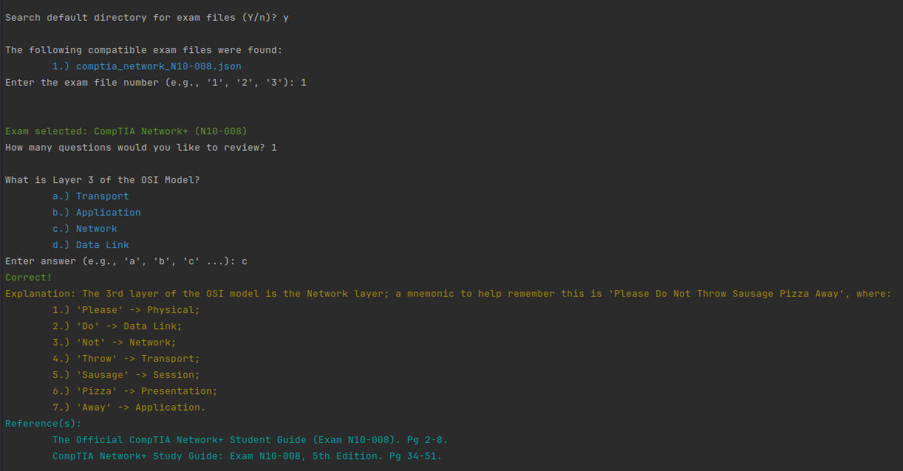

# Term Prep Plus
This is a terminal-based study program where the user can study for a given exam in JSON format.

## Assets
The subdirectory `assets` is the location where the JSON files should be stored for studying.
This program will attempt to create an assets directory if none exists prior to its initial
execution.

---

## Format of JSON Study Files
There are two `structs` that are used in the program:
* `Exam` - the high-level exam that the user is studying for.
* `Question` - represents each question that is present in the exam. An `Exam` comprises many
   questions.

The `structs` mentioned above establish the contract that the JSON format must encompass in order
to function.  Below is the formatting that must be observed in the JSON file to study using Term
Prep Plus:

### `Exam`
The following is the general format that the high-level `Exam` must use; it's essentially the
name of the exam (for example, `"CompTIA Network+ (N10-008)"`) and a list of `question`s:
```json
{
  "name": "Exam_Name",
  "questions": [
    ...
  ]
}
```

### `Question`
Each `Exam` consists of multiple questions, where each `question` has the following:
* `type` - indicates the type of question; there are 3 types:
  * `mc` - multiple choice questions, where one of the choices present in `choices` is correct.
  * `ms` - multiple select questions, where _at least_ one of the choices in `choices` is correct.
  * `ue` - user entry questions, where displaying choices from `choices` are optional.
* `prompt` - the question to be answered;
* `choices` - options for answering the question correctly; there can be any number of choices, but preferably &le; 26 because
   each choice is prefixed with a letter;
* `answer` - the correct answer to the question. The format for the answer depends on the question `type`;
* `explanation` - an optional, more detailed explanation of the answer; used to provide additional insight; leave as an
   empty string if no explanation is desired/needed.
* `refs` - or list of references so the user can refer to those if they get it incorrect.

---
#### Example Multiple Choice Question
```json
{
  "type": "mc", 
  "prompt": "What is the capital of France?",
  "choices": ["Berlin", "Paris", "London", "Rome"],
  "answer": "Paris",
  "explanation": "The capital of France is Paris. Berlin is the capital of Germany; London is the capital of England; Rome is the capital of Italy.",
  "refs": ["https://en.wikipedia.org/wiki/Paris"]
}
```

The user would see the equivalent in their terminal:

<code>What is the capital of France?</code><br>
<code></code><br>
<code style="color: teal;">&nbsp;a. Berlin</code><br>
<code style="color: teal;">&nbsp;b. Paris</code><br>
<code style="color: teal;">&nbsp;c. London</code><br>
<code style="color: teal;">&nbsp;d. Rome</code>


Details for defining multiple choice questions:
* The string provided in `answer` must exactly match the corresponding choice in `choices`; it is case-sensitive.

---
#### Example Multiple Select Question

```json
{
   "type": "ms",
   "prompt": "Which of the following are states in the United States?",
   "choices": ["Wyoming", "Alaska", "Puerto Rico", "Miami", "Hawaii"],
   "answer": ["Wyoming", "Alaska", "Hawaii"],
   "explanation": "Wyoming, Alaska, and Hawaii are states. Puerto Rico is a US territory, and Miami is a city in Florida",
   "refs": [
      "https://en.wikipedia.org/wiki/List_of_states_and_territories_of_the_United_States",
      "https://en.wikipedia.org/wiki/Miami"
   ]
}
```

Details for defining multiple select questions:
* Each answer in the `answer` array must match the corresponding choice in `choices`; each answer is case-sensitive.
* The order of the answers in the `answer` array are irrelevant.

---
#### Example User Entry Question

```json
{
   "type": "ue",
   "prompt": "Using short option(s) only, how can you use grep command to perform a case-insensitive search for the user 'john' in the file named 'user_info.txt'?",
   "choices": "",
   "answer": ["grep", "-i john", "user_info.txt"],
   "explanation": "To search the file 'user_info.txt' for the case-insensitive variations of the string 'john', you would use the grep command, the name of the file to search, and the '-i' option (as opposed to the long option '--ignore-case') with the argument 'john'.",
   "refs": ["https://man7.org/linux/man-pages/man1/grep.1.html"]
}
```

Details for defining user entry questions:
* The first element is positionally important, but the other elements are not and are treated like elements in a set:
  * For the above example, the position of the first element `"grep"` indicates that it must be the first thing entered
    by the user.
  * If the user of the program enters their response, based on the above example, either of the following entries would
    be considered correct:
    * "grep -i john user_info.txt"
    * "grep user_info.txt -i john"
* Entries (other than the first entry) which require a specific positional arrangement should be combined into a single
  element.
  * In the above example, if `"ping"` was required to be followed up with `"-i john user_info.txt"`, then you should
    either combine them so they look like either of the below:
    * `["grep -i john user_info.txt"]`
    * `["grep", "-i john user_info.txt"]`
* 

---
### Example JSON file
```json
{
  "name": "CompTIA Network+ (N10-008)",
  "questions": [
    {
      "type": "mc",
      "prompt": "What is Layer 1 of the OSI Model?",
      "choices": [
        "Data Link",
        "Network",
        "Session",
        "Physical"
      ],
      "answer": "Physical",
      "explanation": "The 1st layer of the OSI model is the Physical layer",
      "refs": [
        "The Official CompTIA Network+ Student Guide (Exam N10-008). Pg 4-8.",
        "CompTIA Network+ Study Guide: Exam N10-008, 5th Edition. Pg 34-51."
      ]
    },
    {
      "type": "mc",
      "prompt": "What is Layer 2 of the OSI Model?",
      "choices": [
        "Application",
        "Data Link",
        "Network",
        "Transport"
      ],
      "answer": "Data Link",
      "explanation": "The 2nd layer of the OSI model is the Data Link layer",
      "refs": [
        "The Official CompTIA Network+ Student Guide (Exam N10-008). Pg 4-8.",
        "CompTIA Network+ Study Guide: Exam N10-008, 5th Edition. Pg 34-51."
      ]
    },
     {
        "type": "ms",
        "prompt": "Which of the following OSI layer level and names are correct?",
        "choices": [
           "Layer 1 -> Physical",
           "Layer 2 -> Data Limit",
           "Layer 3 -> Network",
           "Layer 4 -> Transmission",
           "Layer 5 -> Session",
           "Layer 6 -> Protocol",
           "Layer 7 -> Application"
        ],
        "answer": [
           "Layer 1 -> Physical",
           "Layer 3 -> Network",
           "Layer 5 -> Session",
           "Layer 7 -> Application"
        ],
        "explanation": "Layer 2 is the Data Link layer; layer 4 is the transport layer; layer 5 is the presentation layer.",
        "refs": [
           "The Official CompTIA Network+ Student Guide (Exam N10-008). Pg 4-8.",
           "CompTIA Network+ Study Guide: Exam N10-008, 5th Edition. Pg 34-51."
        ]
     },
     {
        "type": "ue",
        "prompt": "On a Linux machine, using only short options (if needed), how would you use the ping command to issue only 4 ICMP ECHO_REQUEST packets to the address at 68.65.121.157?",
        "choices": "",
        "answer": ["ping", "68.65.121.157", "-c 4"],
        "explanation": "Unlike on a Windows machine (which defaults to 4 ICMP ECHO_RESPONSE packets), the Linux version of the ping command continuously issues ICMP ECHO-REQUEST packets to the given address until stopped with SIGINT (CTRL+C); instead, you have to use the '-c' option with an argument corresponding to the total number of messages you want to send. Although the question provided the address as an IPv4 address, there was no specification for forcing the ping command to force/limit the solution exclusively to IPv4 addresses via the -4 option; using the -4 option has no affect on the result of this question and can be omitted entirely.",
        "refs": [
           "https://man7.org/linux/man-pages/man8.ping.8.html",
           "The Official CompTIA Network+ Student Guide (Exam N10-008). Pg 130-131."
        ]
     }
  ]
}
```

---
## Example User Experience

The below section displays what the user will see when they run the program.

